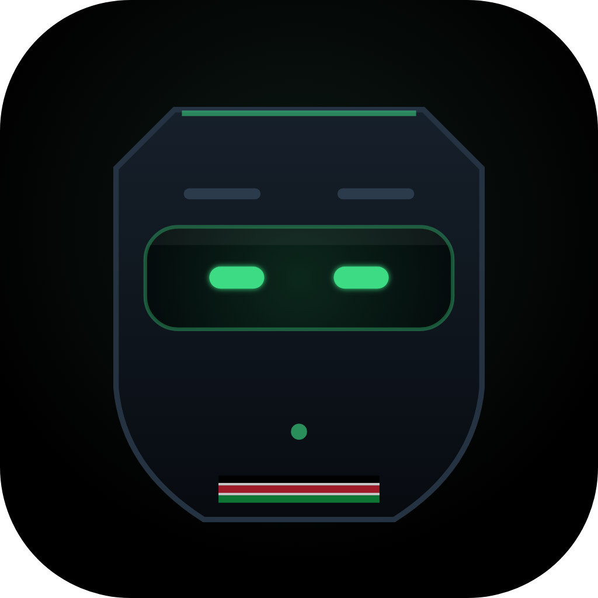
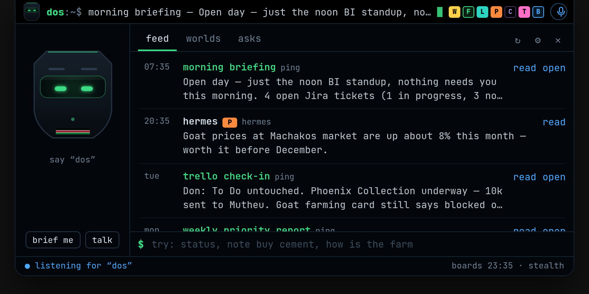
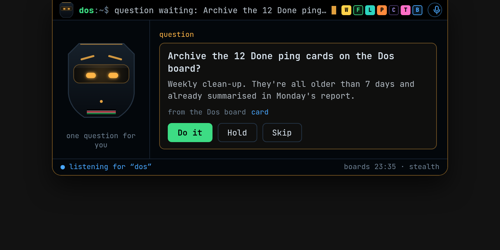
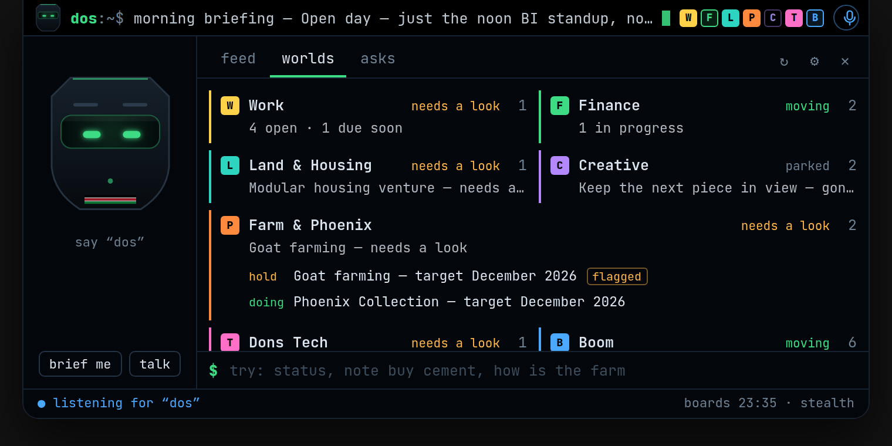
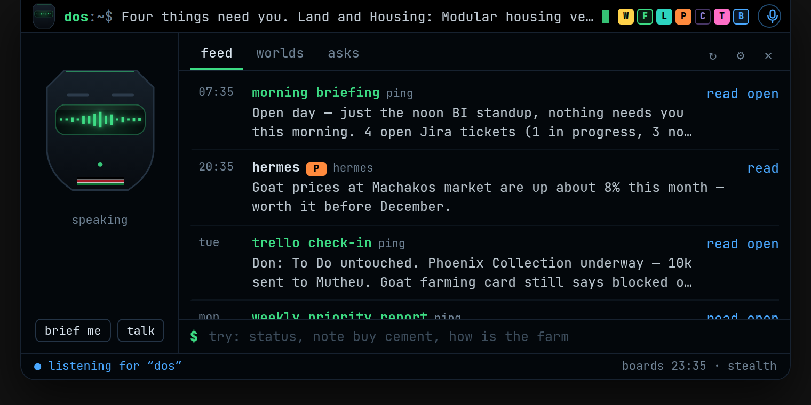
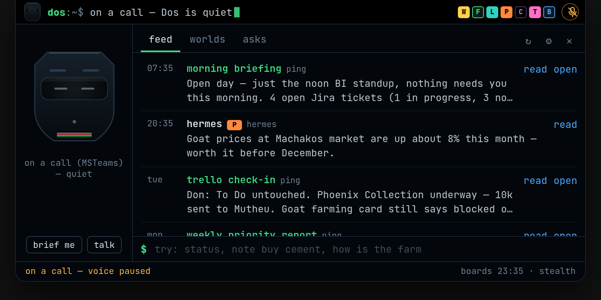

<div align="center">



# Dos Live

**Dos, on your screen.** A terminal bar at the top edge of Windows that shows
what your scheduled tasks just said, how each of your worlds is doing, and what
needs your call. And it answers when you say "Dos".

</div>



## What it does

- **Pings land.** Every card your scheduled tasks drop on the Dos board
  (Morning Briefing, Trello Check-In, Weekly Priority Report…) shows up on the
  bar within a minute, drops the panel open and is read out loud. It doesn't
  depend on a phone notification pipe.
- **One pill per world.** Work, Finance, Land & Housing, Farm & Phoenix,
  Creative, Dons Tech and Boom, read live from the Don and Boom boards. A pill
  fills in when something is due soon or flagged, and pulses when something is
  overdue.
- **Dos asks, you answer.** Questions from Dos (a card in **Dos asks**) or from
  Hermes (`dosctl ask`) appear with **Do it / Hold / Skip**. Your answer goes
  back to Trello, or straight back to Hermes.
- **Talk to it.** Say "Dos, status", "Dos, what's new", "Dos, how's the farm",
  "Dos, do it", "Dos, note buy cement for Matuu". You can also type the same
  thing at the panel's `$` prompt.
- **Hermes, locally.** Anything that isn't about the boards goes to your
  Hermes agent's local API, and the answer is spoken. Anything that mentions
  work never leaves the app.
- **Stealth by default.** The island is invisible to screen sharing and
  recording (Teams, Meet, Zoom, OBS). You see it; they don't. When another app
  holds the microphone, Dos goes quiet and stops listening.

<table>
<tr>
<td></td>
<td></td>
</tr>
<tr>
<td></td>
<td></td>
</tr>
</table>

## Install

**From CI (no toolchain needed):** open the repo's **Actions** tab → latest
green **build** run → download **DosLive-windows** → run
`Dos Live_0.1.0_x64-setup.exe`. It installs for your user only (no admin). It
isn't code-signed, so SmartScreen will ask once: **More info → Run anyway**.

**From source:** needs [Rust](https://rustup.rs), Node 20+, and Visual Studio
Build Tools ("Desktop development with C++").

```powershell
git clone https://github.com/doncoding-ai/dos-live.git C:\dos\build\dos-live
cd C:\dos\build\dos-live
npm install
npm run pack          # installer → target\release\bundle\nsis\
```

`npm run dev:app` runs it live-reloading instead.

## Set up (five minutes)

1. **Trello.** Tray icon → **Settings…** → Trello. Create a Power-Up at
   [trello.com/power-ups/admin](https://trello.com/power-ups/admin), paste its
   API key, click **get a token** (read and write), paste the token. Click
   **Test connection**, then **Create the "Dos asks" lists**.
2. **Voice.** Windows Settings → Privacy & security → Speech → turn on
   **Online speech recognition**. Short commands ("Dos, status") work without
   it. Free sentences (notes, questions) need it. Pick Dos's voice in Settings.
   A male English voice is used by default. Add voices under Time & language →
   Speech.
3. **Scheduled tasks.** Paste the block from [docs/DOS-BOARD.md](docs/DOS-BOARD.md)
   into the task prompts that should ask before acting.
4. **Hermes (optional).** In `~/.hermes/config.yaml` enable the API server
   (`API_SERVER_ENABLED=true`, `API_SERVER_KEY=…`, default port 8642). Paste
   the key in Settings → Hermes and switch it on. Copy
   [hermes/dos-live/SKILL.md](hermes/dos-live/SKILL.md) into Hermes' skills so it
   knows how to reach you through `dosctl`.

## Talking to Dos

| Say | Dos does |
|---|---|
| "Dos" | Chimes and listens for a sentence |
| "Dos, status" / "brief me" | Says what needs you, most urgent first |
| "Dos, what's new" | Reads the latest ping |
| "Dos, read that" | Reads whatever is in focus in full |
| "Dos, open that" | Opens the briefing page or card |
| "Dos, do it" / "hold" / "skip" | Answers the waiting question |
| "Dos, finance" / "how's the farm" / "Dons Tech" | One line on that world |
| "Dos, note …" / "remind me to …" | Adds a 📝 card to the Dos board |
| "Dos, quiet" / "speak up" | Mutes or unmutes the voice |
| "Dos, hide" / "show" | Closes or opens the panel |
| anything else | Goes to Hermes (unless it's about work) |

Push-to-talk: **Ctrl+Alt+D** (changeable), or the mic on the bar.

## dosctl — for Hermes and scripts

```
dosctl say "Goat prices are up 8% in Machakos" --world farm --speak
dosctl ask "Send the drafted reply to the landlord?" --timeout 300   # prints do_it | hold | skip
dosctl status
```

`dosctl.exe` is installed next to `Dos Live.exe`. It talks over a named pipe
that only your Windows account can open: the pipe carries your SID in its name,
its ACL admits only you and SYSTEM, and both ends check the other runs as
you. Remote clients are rejected. Anything filed under `work` is refused.

## Privacy and security

- Trello and Hermes keys live in **Windows Credential Manager**. They are never
  written to disk, never sent to the windows, and never put in URLs.
- Settings are in `%APPDATA%\Dos Live\settings.json`. The log is in
  `%LOCALAPPDATA%\Dos Live\dos-live.log`. It records events, never what you
  said or what a card contains.
- Network traffic goes to api.trello.com and, if enabled, your own Hermes on
  127.0.0.1 (other hosts are refused). Nothing else. No telemetry.
- Wake-word listening matches a fixed phrase list on the device. Dictation
  (after the wake word) uses Windows' online speech service. That's a Microsoft
  service and your choice in Windows privacy settings.
- Anything that mentions work (Sportserve, Jira, tickets, sprint, BDI…) is
  answered from the Work pill and never sent to Hermes. With *discreet Work*
  on (the default), the Work pill shows counts only, never titles.
- Answering a question moves a card and adds a comment. Dos Live never deletes
  anything.

## How it's built

```
crates/dos-core   the brain: Trello → pills, pings, asks; speech → intents; sentences.
                  Pure Rust, no OS code, unit-tested (cargo test).
crates/dos-win    every Windows call: WinRT speech in/out, the relay pipe,
                  the call guard, capture exclusion.
crates/dosctl     the relay CLI.
src-tauri         the app: polling, voice, relay, tray, the island window.
src               the island and settings UI (TypeScript, Canvas 2D, no framework).
```

Dos himself is drawn in code (`src/dos.ts`): a monolith head whose visor
tracks your cursor, scans while thinking, and turns into a live waveform while
he talks. The collar carries the Kenyan flag.

`scripts/wincheck.sh` type-checks all Windows code from Linux against the real
`windows-rs` bindings. CI runs it, plus the full build on `windows-latest`.
`npm run dev` shows the island in a browser with sample data. Add
`?view=panel|worlds|alert|ask|speaking|call|setup` to jump to a state.

Island placement and click-through follow the approach of
[Coucou](https://github.com/Louis-CFM/coucou) (MIT). See LICENSE.
